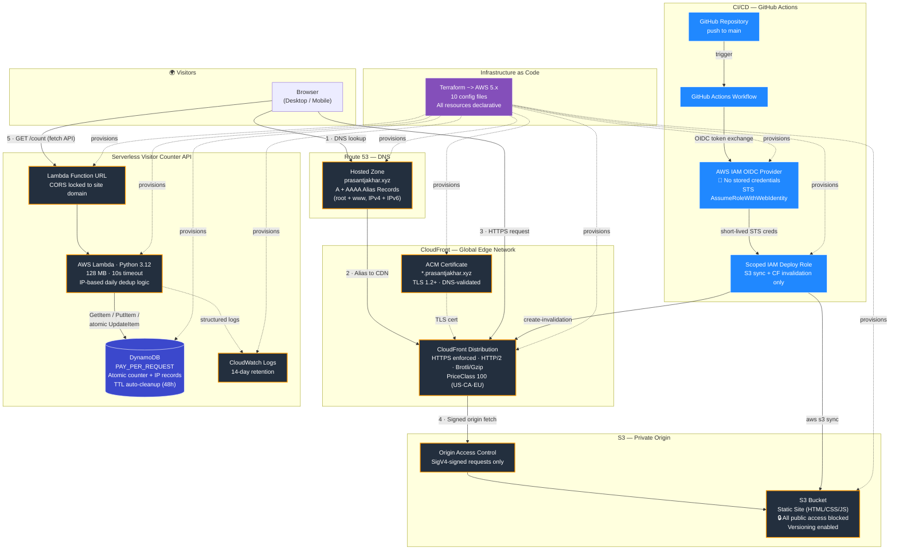
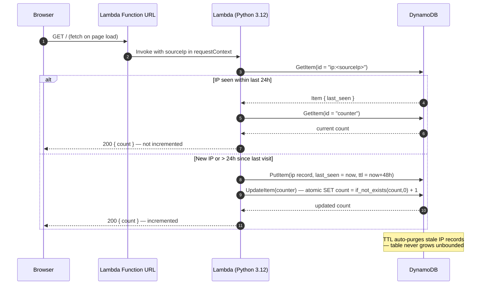
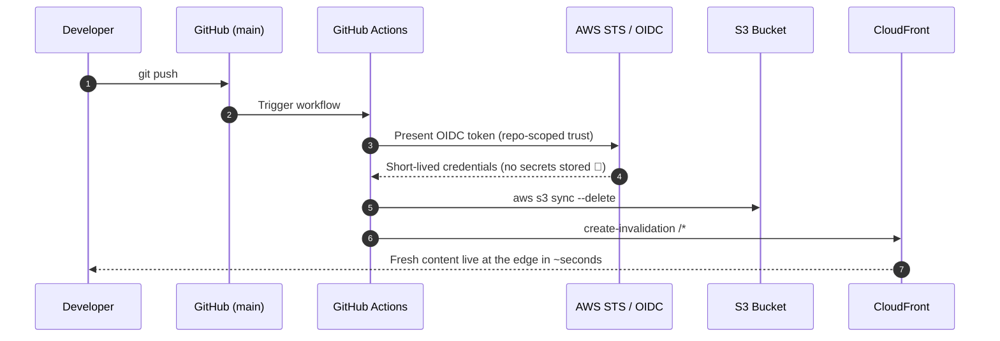

<div align="center">

# ☁️ Cloud Resume Challenge — AWS Serverless Portfolio

**A production-grade, fully serverless portfolio website — provisioned end-to-end with Terraform and deployed via a zero-credential GitHub Actions pipeline.**

[](https://prasantjakhar.xyz)
[](./terraform)
[](https://aws.amazon.com)
[](./.github/workflows/front-end-cicd.yml)
[](./terraform/lambda/visitor_counter.py)

*Built for the [Cloud Resume Challenge](https://cloudresumechallenge.dev/docs/the-challenge/aws/) — and then taken further.*

</div>

---

## 📐 Architecture



### Visitor Counter — Request Lifecycle



### CI/CD — Zero-Credential Deployment



---

## ✨ Highlights

| | |
|---|---|
| 🔒 **Private-by-default origin** | S3 bucket blocks *all* public access; CloudFront reaches it exclusively through **Origin Access Control** (SigV4-signed requests) |
| 🔑 **Zero stored cloud credentials** | CI/CD authenticates via **GitHub OIDC → STS AssumeRoleWithWebIdentity** — no `AWS_ACCESS_KEY_ID` anywhere |
| ⚡ **API Gateway–free API** | A **Lambda Function URL** serves the counter — fewer moving parts, zero API Gateway cost, CORS locked to the site's domain |
| 🧮 **Honest analytics** | The counter dedupes by IP with a 24-hour window using an **atomic DynamoDB update** — refresh-spamming doesn't inflate the count |
| ♻️ **Self-cleaning data** | IP records carry a **DynamoDB TTL** (48 h) so the table stays tiny forever |
| 🏗️ **100% Infrastructure as Code** | Every resource — DNS to IAM policy — is declared in **Terraform**; the whole stack rebuilds with one `terraform apply` |
| 🌐 **IPv6 + HTTP/2 + compression** | Dual-stack DNS (A + AAAA), TLS 1.2+, Brotli/Gzip at the edge |
| 💰 **Near-zero cost** | On-demand DynamoDB, 128 MB Lambda, PriceClass_100 CloudFront — runs comfortably in the free tier |

---

## 🗂️ Repository Structure

```
cloud-resume-challenge/
├── index.html                     # Single-page portfolio (semantic HTML5)
├── styles.css                     # Design system — CSS variables, grid/flex, animations
├── script.js                      # Visitor counter, canvas hero, forms, scroll FX
├── images/                        # Optimized site assets
├── .github/
│   └── workflows/
│       └── front-end-cicd.yml     # OIDC deploy: S3 sync + CloudFront invalidation
└── terraform/
    ├── main.tf                    # Providers, versions, (optional) S3 remote state
    ├── variables.tf               # Inputs + common tag locals
    ├── s3.tf                      # Private bucket, OAC policy, versioning
    ├── cloudfront.tf              # Distribution, OAC, managed cache policies
    ├── acm.tf                     # Wildcard cert + DNS validation
    ├── route53.tf                 # Zone + A/AAAA aliases (root & www)
    ├── dynamodb.tf                # On-demand table + TTL
    ├── lambda.tf                  # Function, Function URL (CORS), log group
    ├── iam.tf                     # Lambda role, OIDC provider, CI deploy role
    ├── outputs.tf                 # URLs, ARNs, nameservers, role ARN
    └── lambda/
        └── visitor_counter.py     # Counter logic — IP dedup + atomic increment
```

---

## 🧰 Technology Stack

| Layer | Technology | Why |
|---|---|---|
| **Frontend** | HTML5 · CSS3 · Vanilla JS (ES6+) | Zero framework overhead; Intersection Observer scroll FX; canvas particle hero |
| **Hosting** | S3 + CloudFront | Private origin, global edge caching, HTTPS everywhere |
| **DNS / TLS** | Route 53 + ACM | Alias records (free lookups), auto-validated wildcard cert |
| **API** | Lambda Function URL | Simpler + cheaper than API Gateway for a single endpoint |
| **Compute** | AWS Lambda (Python 3.12 / boto3) | Scale-to-zero, pay-per-invoke |
| **Database** | DynamoDB (on-demand) | Atomic counters, TTL cleanup, single-table design |
| **IaC** | Terraform (AWS provider ~> 5.0) | Reproducible, reviewable, one-command rebuild |
| **CI/CD** | GitHub Actions + OIDC | Keyless deploys with least-privilege IAM |
| **Observability** | CloudWatch Logs (14-day retention) | Bounded log storage costs |

---

## 🚀 Deploying It Yourself

### Prerequisites
- AWS account + [Terraform ≥ 1.5](https://developer.hashicorp.com/terraform/install)
- A registered domain (this project uses `prasantjakhar.xyz`)

### 1 · Provision the infrastructure

```bash
cd terraform
# Edit terraform.tfvars — domain_name, s3_bucket_name, github_repo, etc.
terraform init
terraform plan
terraform apply
```

### 2 · Point your registrar at Route 53

```bash
terraform output route53_nameservers   # set these at your domain registrar
```

### 3 · Wire up CI/CD (repo secrets)

| Secret | Source |
|---|---|
| `AWS_ROLE_ARN` | `terraform output github_actions_role_arn` |
| `S3_BUCKET_NAME` | `terraform output s3_bucket_name` |
| `CLOUDFRONT_DISTRIBUTION_ID` | `terraform output cloudfront_distribution_id` |

### 4 · Connect the counter

```bash
terraform output lambda_function_url   # paste into initVisitorCounter() in script.js
```

Push to `main` — the workflow syncs the site to S3 and invalidates the CloudFront cache. Done. 🎉

---

## 🔐 Security Design

- **S3**: all four public-access blocks enabled; bucket policy grants `s3:GetObject` to CloudFront's service principal **only when** the request originates from *this* distribution (`AWS:SourceArn` condition)
- **CloudFront**: `redirect-to-https`, minimum TLS 1.2 (2021 policy), SNI
- **Lambda IAM**: scoped to exactly `GetItem` / `PutItem` / `UpdateItem` on the one table — nothing else
- **CI role trust**: OIDC federation restricted to `repo:<org>/<repo>:*` — no other repository can assume it
- **CORS**: Function URL only accepts browser calls from `https://prasantjakhar.xyz` / `www`
- **Secrets**: none. No long-lived AWS keys exist in GitHub or in code

---

## 💸 Estimated Monthly Cost

| Service | Usage profile | Cost |
|---|---|---|
| S3 | < 50 MB storage, low GETs (edge-cached) | ~$0.01 |
| CloudFront | Free tier: 1 TB egress / 10M requests | $0.00 |
| Lambda | Free tier: 1M requests / 400k GB-s | $0.00 |
| DynamoDB | On-demand, tiny item counts | ~$0.00 |
| Route 53 | Hosted zone | $0.50 |
| **Total** | | **≈ $0.51/mo** + domain registration |

---

## ✅ Challenge Checklist

| # | Requirement | Implementation |
|---|---|---|
| 1 | Certification | AWS Certified Solutions Architect — Associate |
| 2–3 | HTML + CSS resume | Semantic single-page site, custom design system, responsive |
| 4 | S3 static site | Private bucket behind CloudFront OAC |
| 5 | HTTPS | CloudFront + ACM wildcard cert |
| 6 | Custom DNS | Route 53, dual-stack (A + AAAA), root + www |
| 7 | JavaScript counter | `fetch` with graceful fallback + count-up animation |
| 8 | Database | DynamoDB on-demand, atomic counter, TTL cleanup |
| 9 | API | Lambda Function URL (deliberate simplification over API Gateway) |
| 10 | Python | boto3 handler with per-IP daily dedup |
| 11 | Tests | 🔜 Roadmap — pytest + moto |
| 12 | IaC | Terraform (10 files, full stack) |
| 13 | Source control | This repo |
| 14–15 | CI/CD | GitHub Actions with OIDC keyless auth |
| 16 | Blog post | 🔜 Roadmap |

---

## 🗺️ Roadmap

- [ ] `pytest` + `moto` unit tests for the Lambda, wired into CI
- [ ] Terraform CI pipeline (`fmt` / `validate` / `plan` on PR)
- [ ] Remote Terraform state (S3 backend + DynamoDB locking)
- [ ] CloudWatch alarm on Lambda errors → SNS email
- [ ] Asset pipeline: WebP images, minified CSS/JS, cache-control headers
- [ ] Blog post write-up of lessons learned

---

<div align="center">

Built by **Prasant Jakhar** · [prasantjakhar.xyz](https://prasantjakhar.xyz)

*Feel free to fork this as a starting point for your own Cloud Resume Challenge.*

</div>
